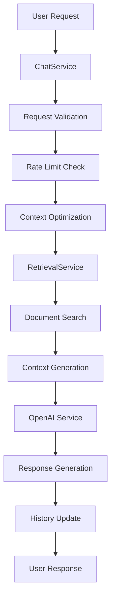

# Legal RAG Backend System

A sophisticated backend system for handling legal document retrieval and conversation management using RAG (Retrieval Augmented Generation) technology.

## Overview

This system provides a robust backend for legal document retrieval and conversation management, featuring:
- Advanced document retrieval using vector embeddings
- Intelligent conversation history management
- Context-aware response generation
- Rate limiting and request validation
- Comprehensive error handling and retry mechanisms

## Architecture

### Core Components

1. **ChatService**
   - Manages conversation state and history
   - Handles message processing and routing
   - Implements rate limiting and validation
   - Manages OpenAI context optimization

2. **RetrievalService**
   - Handles document retrieval using vector embeddings
   - Manages document indexing and search
   - Implements RAG pipeline for context-aware responses

3. **OpenAIService**
   - Manages OpenAI API interactions
   - Handles token management and context window optimization
   - Implements response generation with proper prompting

### Data Flow



## Key Features

### 1. Conversation Management
- Maintains conversation history with proper context
- Implements smart context window management
- Handles follow-up questions with context awareness
- Provides conversation summarization

### 2. Document Retrieval
- Vector-based document search
- Context-aware document selection
- Smart document chunking and indexing
- Relevance scoring and ranking

### 3. Response Generation
- RAG-based response generation
- Context-aware answer formulation
- Legal domain-specific prompting
- Proper citation and reference handling

### 4. System Management
- Rate limiting and request validation
- Error handling and retry mechanisms
- State management and cleanup
- Performance monitoring

## Workflow

### 1. Request Processing
```typescript
// 1. Request received
handleChat(userId, question)

// 2. Validation and rate limiting
validateRequest(userId, question)
checkRateLimit(userId)

// 3. Context optimization
optimizeOpenAIContext(state)

// 4. Document retrieval
searchRelevantDocuments(question)

// 5. Response generation
handleRagQuestion(question, context)

// 6. History update
updateConversationHistory(userId, history)
```

### 2. Context Management
```typescript
// 1. Get conversation state
getOrCreateState(userId)

// 2. Update history
updateState(userId, { history: newHistory })

// 3. Optimize context
optimizeOpenAIContext(state)

// 4. Update summary
updateConversationSummary(state, history)
```

### 3. Document Processing
```typescript
// 1. Document search
searchRelevantDocuments(query)

// 2. Context formatting
formatSearchResults(results)

// 3. Response generation
generateResponseWithContext(question, context, history)
```

## Configuration

### Rate Limiting
```typescript
rateLimitConfig: {
    maxRequestsPerMinute: 60,
    maxTokensPerRequest: 4000,
    maxConcurrentRequests: 10
}
```

### Context Management
```typescript
MAX_HISTORY_LENGTH = 10
MAX_TOKENS_PER_MESSAGE = 4000
MAX_TOTAL_TOKENS = 8000
STATE_EXPIRY_MS = 30 * 60 * 1000 // 30 minutes
OPENAI_CONTEXT_EXPIRY_MS = 5 * 60 * 1000 // 5 minutes
```

### Retry Configuration
```typescript
retryConfig: {
    maxRetries: 3,
    backoffMs: 1000,
    maxBackoffMs: 5000
}
```

## Error Handling

The system implements comprehensive error handling:

1. **Request Validation**
   - Input validation
   - Rate limit checking
   - Malicious content detection

2. **Retry Mechanism**
   - Exponential backoff
   - Maximum retry attempts
   - Error logging

3. **Fallback Responses**
   - Graceful degradation
   - Alternative response generation
   - Error reporting

## Monitoring and Logging

The system includes detailed logging for:
- Request processing
- Context management
- Document retrieval
- Response generation
- Error handling
- Performance metrics

## Best Practices

1. **Context Management**
   - Maintain conversation history
   - Optimize context window
   - Handle token limits
   - Update summaries regularly

2. **Document Retrieval**
   - Use vector embeddings
   - Implement relevance scoring
   - Handle document chunks
   - Maintain document context

3. **Response Generation**
   - Use RAG for accuracy
   - Maintain legal context
   - Handle citations
   - Provide clear explanations

4. **System Management**
   - Implement rate limiting
   - Handle errors gracefully
   - Clean up resources
   - Monitor performance

## API Endpoints

### Chat Endpoints
```typescript
POST /api/chat
- Request: { userId: string, question: string }
- Response: { response: string }

GET /api/history/:userId
- Response: { history: ChatMessage[] }

DELETE /api/chat/:userId
- Response: { success: boolean }
```

### Document Endpoints
```typescript
POST /api/documents
- Request: { documents: Document[] }
- Response: { success: boolean }

GET /api/documents/search
- Request: { query: string }
- Response: { results: SearchResult[] }
```

## Development

### Setup
1. Clone the repository
2. Install dependencies: `npm install`
3. Set up environment variables
4. Start the server: `npm start`

### Environment Variables
```env
OPENAI_API_KEY=your_api_key
QDRANT_HOST=localhost
QDRANT_PORT=6333
QDRANT_COLLECTION=your_collection
```

### Testing
```bash
# Run tests
npm test

# Run with coverage
npm run test:coverage
```

## License

