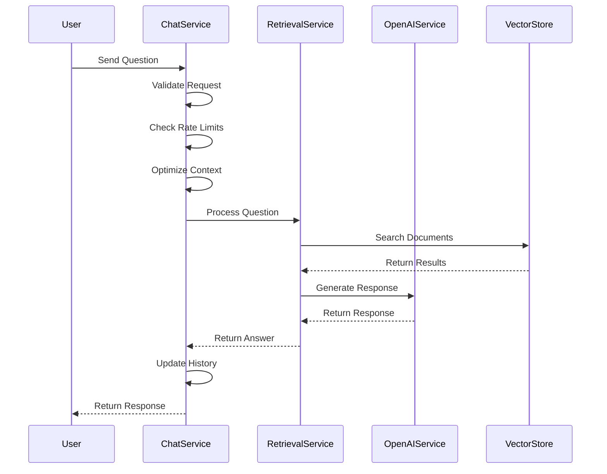
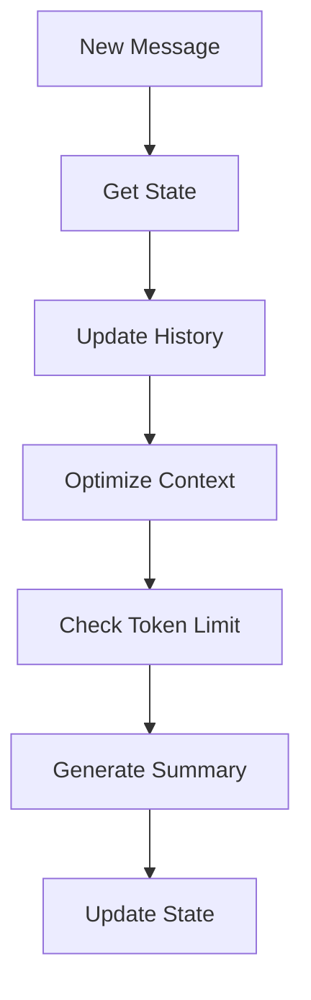

# System Architecture

## Overview

The Legal RAG Backend System is built with a modular architecture that separates concerns and provides clear interfaces between components. This document details the system's architecture, components, and their interactions.

## System Components

### 1. ChatService
The core service for managing conversations and user interactions.

#### Key Responsibilities
- Conversation state management
- Message processing and routing
- Rate limiting and validation
- OpenAI context optimization
- History management

#### State Management
```typescript
interface ConversationState {
    history: ChatMessage[];
    previousQuestions: string[];
    lastResponse?: string;
    openAIContext: {
        messages: ChatMessage[];
        lastTokenCount: number;
        lastUpdateTime: number;
        summary: string;
        keyPoints: string[];
        lastAnalysis?: {
            mainTopics: string[];
            keyLegalConcepts: string[];
            importantDecisions: string[];
            relevantLaws: string[];
            conversationFlow: string;
            timestamp: number;
        };
    };
}
```

### 2. RetrievalService
Handles document retrieval and RAG pipeline implementation.

#### Key Responsibilities
- Document indexing and search
- Vector similarity search
- Context generation
- Document chunking and processing

#### Document Processing Flow
1. Query expansion
2. Initial document search
3. Case identification
4. Chunk retrieval
5. Context formatting
6. Response generation

### 3. OpenAIService
Manages interactions with OpenAI's API.

#### Key Responsibilities
- API communication
- Token management
- Context window optimization
- Response generation

#### Context Management
- Token counting
- Context window optimization
- Message formatting
- Error handling

## Data Flow

### 1. Request Processing


### 2. Context Management


## Component Interactions

### 1. ChatService ↔ RetrievalService
- Question processing
- Context passing
- Response handling
- History management

### 2. RetrievalService ↔ VectorStore
- Document search
- Similarity matching
- Context retrieval
- Result formatting

### 3. OpenAIService ↔ OpenAI API
- API communication
- Token management
- Response generation
- Error handling

## State Management

### 1. Conversation State
- Maintains conversation history
- Tracks previous questions
- Stores context information
- Manages summaries

### 2. Rate Limiting State
- Tracks request counts
- Manages time windows
- Handles concurrent requests
- Enforces limits

### 3. Context State
- Manages OpenAI context
- Tracks token usage
- Stores summaries
- Handles analysis

## Error Handling

### 1. Request Validation
- Input validation
- Rate limit checking
- Malicious content detection
- Format validation

### 2. API Errors
- Network errors
- Rate limit errors
- Token limit errors
- Timeout handling

### 3. Processing Errors
- Document retrieval errors
- Context optimization errors
- Response generation errors
- State update errors

## Performance Considerations

### 1. Caching
- Document caching
- Context caching
- Response caching
- State caching

### 2. Optimization
- Token optimization
- Context window management
- Document chunking
- Response formatting

### 3. Resource Management
- Memory usage
- CPU utilization
- Network bandwidth
- Storage requirements

## Security

### 1. Input Validation
- Request validation
- Content filtering
- Rate limiting
- Access control

### 2. Data Protection
- State encryption
- Secure storage
- Access logging
- Audit trails

### 3. API Security
- Authentication
- Authorization
- Rate limiting
- Error handling

## Monitoring and Logging

### 1. Performance Metrics
- Response times
- Token usage
- Error rates
- Resource usage

### 2. System Health
- Component status
- Error tracking
- Resource monitoring
- State validation

### 3. Usage Analytics
- Request patterns
- User behavior
- Error patterns
- Performance trends 